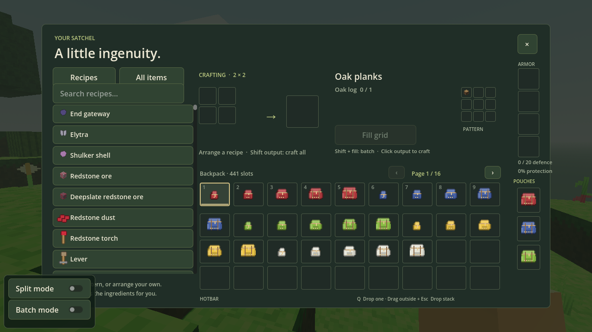
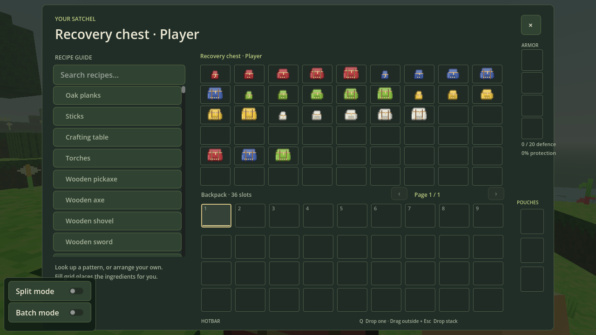

# Brewing, enchantments and colored pouches

## Brewing

Craft a brewing stand from a blaze rod and cobblestone. Place one ingredient, blaze powder fuel, and up to three bottles in its screen. One ingredient brews all compatible bottles in **10 active seconds**. One blaze powder powers **20 batches**. Progress pauses with the world, continues while the brewing screen is open, and survives saving. Changing an ingredient or bottle resets that batch’s progress. Hoppers can feed ingredients from above, fuel and bottles from the sides, and collect bottles below.

Craft glass bottles, then fill them from water or a filled cauldron. Water + nether wart makes an awkward potion. Grow nether wart on soul sand; fortress gardens and chests supply it.

| Add to awkward potion | Result |
|---|---|
| Glistering melon | Healing |
| Golden carrot | Night vision |
| Sugar | Swiftness |
| Magma cream | Fire resistance |
| Blaze powder | Strength |
| Pufferfish | Water breathing |
| Ghast tear | Regeneration |
| Spider eye | Poison |
| Rabbit foot | Leaping |
| Phantom membrane | Slow falling |
| Turtle shell | Turtle Master |
| Stone | Infestation |
| Slime block | Oozing |
| Cobweb | Weaving |
| Breeze rod | Wind charging |

Fermented spider eye is crafted from a spider eye, brown mushroom and sugar. Add it to water or mundane potion for weakness. It changes healing or poison to harming, swiftness or leaping to slowness, night vision to invisibility, and luck to bad luck.

Redstone extends supported potions. Glowstone dust strengthens supported potions; switching between these modifiers replaces the previous modifier. Gunpowder makes splash bottles, and dragon breath changes splash bottles to lingering bottles. Use a glass bottle near dragon breath to collect it. Surround a lingering potion with eight arrows in the crafting table to make eight tipped arrows with that potion’s effect and strength.

Most timed effects last three minutes, extended versions eight minutes, and strong versions half the normal duration. Poison, regeneration and decay start at 45 seconds. Slowness starts at 90 seconds, and strong slowness is level IV for 20 seconds. Turtle Master combines resistance and slowness. Tipped arrows apply one eighth of the potion duration; lingering effects use one quarter. The tooltip shows each exact effect, strength and duration.

Healing and harming act immediately, with reversed behavior on undead. Poison cannot kill; decay can. Infestation can release silverfish when hurt, oozing spawns slimes on death, weaving leaves cobwebs, and wind charging releases a burst on death. Water extinguishes burning and milk clears effects. Active effects appear beside the HUD and retain their strength when saved.

All 26 source potion types plus water are included, with 234 registered bottle and arrow variants. Mundane and thick potions have no effects. Luck appears in stronghold loot, decay in Nether loot, and ominous bottles drop from roaming pillagers. Drinking an ominous bottle and entering a village triggers a three-wave raid; defending it grants temporary trade discounts. These are Voxey’s acquisition paths where the source has no ordinary brewing recipe.

Phantoms appear on later nights and drop membranes. Breezes appear in deep caves and drop rods. Turtles near shores drop scutes, five of which craft a turtle shell. Stronghold chests can contain a heavy core for a mace. These small additions supply the ingredients and equipment without reproducing Mineclonia’s trial chambers or full raid system.

## Enchanting

Use the enchanting table to choose compatible equipment or a book and an enchantment. The three offers cost 1–3 lapis and 1–3 XP levels; tiers II and III require levels 10 and 30, with 5 and 15 nearby bookshelves respectively. Shelves require an air gap. Books, fishing rods, crossbows, tridents and maces are supported alongside the original tools, bows and armor.

Combine equal-level enchanted books at an anvil to raise a level up to its source maximum; different levels keep the higher one. Conflicting or incompatible enchantments cannot be added. Librarian trades, treasure chests and lucky fishing can supply treasure enchantments. Grindstones return XP and remove ordinary enchantments, while curses remain.

Curse of Binding prevents removing worn armor in survival until it breaks or the player dies. Curse of Vanishing destroys the enchanted item on death. Mending spends newly earned XP to repair worn or held gear. Infinity needs a normal arrow and produces no recoverable extra arrow; tipped arrows are consumed normally. Crossbows support Quick Charge, Multishot and Piercing.

Tridents can be thrown and recovered. Loyalty returns them, Impaling improves damage in water, Riptide launches the player in water or rain, and Channeling calls lightning on exposed targets during thunderstorms. `/weather clear`, `/weather rain` and `/weather thunder` select weather. Maces support Density, Breach and Wind Burst.

## Pouches and wool



All sixteen wool and dye colors are available: white, grey, light grey, black, yellow, orange, red, magenta, purple, blue, cyan, lime, green, pink, light blue and brown. Craft any wool with a dye to recolor it.

Craft a **level 1 pouch** at a table with a chest and four string. Add dyed wool in the top middle to choose its color, or leave that space empty for white:

```text
String  Wool / empty  String
—       Chest         —
String  —             String
```

Combine **two pouches of the same level** in any two crafting slots to make the next level, up to level 5. Different colors can be combined; the first pouch in reading order supplies the result's color. Both pouches' contents are retained, merging compatible stacks. If their contents cannot fit, the recipe refuses to consume either pouch: empty some cargo first.

| Level | Storage slots | Added inventory pages when equipped |
| --- | ---: | ---: |
| 1 | 27 | 1 |
| 2 | 54 | 2 |
| 3 | 81 | 3 |
| 4 | 108 | 4 |
| 5 | 135 | 5 |

Each level has a visibly larger texture, with extra pockets, straps and level markings. All five levels come in all sixteen colors. Craft a pouch with **one dye or wool block** to recolor it without losing contents. Existing single and double pouches load as levels 1 and 2.

Place up to **three pouches in the dedicated slots beside the inventory**. Equipped pouches extend the inventory and automatically receive pickups when earlier slots fill. Use the page arrows above the inventory; the nine hotbar slots remain visible on every page. Three level 5 pouches give 441 total slots across 16 pages, including the original backpack.

You can carry more pouches in ordinary backpack slots. **Only the three equipped pouches add inventory pages.** Right click a carried or equipped pouch to open its contents and move items in or out. Holding a pouch and right clicking also opens it. Each pouch has its own page controls and a Back button. Its owner slot stays locked while you inspect it; close the view before moving the pouch or changing equipment.

Unequipping removes that pouch's inventory pages and takes all its cargo along. Pouches cannot contain other pouches. Durability, enchantments and written-book text survive moving, dropping, upgrading, dyeing, saving and loading. On death, equipped pouches go into a recovery chest with their cargo inside once. Q drops one item; dragging a cursor stack outside the inventory and pressing Escape drops that stack.

## Death and recovery



Dying leaves **two bones and a recovery chest** near your death position. The death screen shows the dimension and chest coordinates. The chest persists until you remove it; its contents do not expire on an item-drop timer.

The chest has 54 slots. The first 36 hold your main backpack, followed by your three equipped pouches and four armor slots. Any crafting-grid items and cursor stack also fit. Items on additional inventory pages stay packed inside their pouches; they are never duplicated as loose chest entries. Pouches carried in the ordinary backpack retain their contents too. Curse of Vanishing still destroys affected items.

Right click the chest to recover your belongings. Move pouches back to the equipment slots to restore their pages, or carry them and inspect them normally. Breaking the chest drops its remaining items, including intact filled pouches. Recovery chests do not join neighboring ordinary chests or move with pistons. Repeated deaths leave separate chests.
