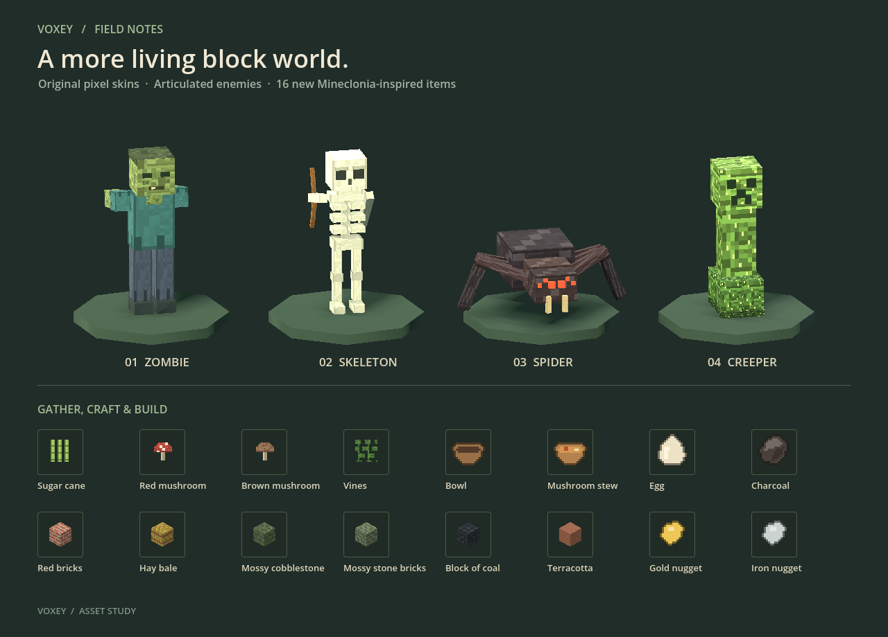

# Content and art update

All textures and models are original procedural art. Enemy skins, block faces, and item silhouettes are generated locally at startup or on first use; there are no downloaded asset dependencies. Item icons, held items, and pickups share the same pixel artwork. Meshes and textures are cached, and damage tint materials belong to individual creatures.

## Gathering and crafting

The new content is available in the Creative catalog and through `/give`, as well as the survival paths below. Existing built-in item/node ids and the six reserved mod texture tiles are retained. Mod item registration skips built-in ids, preventing a collision with the clock. New items and blocks use stable IDs above 255; voxel arrays use 32-bit integers. Existing save IDs remain valid.

| Addition | Survival source and use |
| --- | --- |
| Sugar cane | Find stalks along unfrozen river/lake banks. Plant on sand, dirt, or grass with water beside the supporting block. Planted stalks grow every 60 active seconds, up to three blocks. Cut above the bottom block for regrowth. One cane makes sugar; three across a crafting table make three paper. |
| Red mushroom | Gather in temperate meadows; replant on grass, dirt, or mossy cobblestone. Use in stew. |
| Brown mushroom | Gather in temperate meadows; replant on grass, dirt, or mossy cobblestone. Use in stew. |
| Vines | Find beside some oak trunks. Harvest with shears; combine with cobblestone or stone bricks for mossy variants. |
| Red bricks | Smelt clay balls into bricks, then combine four bricks in a 2×2 square. |
| Hay bale | Nine wheat at a table; unpack to recover nine wheat. |
| Mossy cobblestone | Cobblestone + vines, in any arrangement. |
| Mossy stone bricks | Stone bricks + vines, in any arrangement. |
| Block of coal | Nine coal at a table; unpack to recover nine coal. Also fuels a furnace for 800 ticks. Charcoal cannot make coal blocks. |
| Terracotta | Smelt a clay block. Four clay balls reconstruct a clay block; mining clay yields four balls. |
| Charcoal | Smelt an oak log. Fuels a furnace for 80 ticks, or combine with a stick to make four torches. |
| Bowl | Three planks in a V at a table make four bowls. |
| Mushroom stew | Bowl + one mushroom of each color, in any arrangement. Restores six hunger and returns the bowl. Does not stack. |
| Gold nugget | One gold ingot gives nine nuggets; nine nuggets at a table return one ingot. |
| Iron nugget | One iron ingot gives nine nuggets; nine nuggets at a table return one ingot. |
| Egg | Adult chickens lay a collectible egg every 300–600 active seconds; baby egg timers remain frozen. Pumpkin + sugar + egg makes pumpkin pie in any arrangement. Stacks to 16. |

World generation places wild cane, mushrooms, and vines wherever terrain is regenerated, preserving saved node edits. Growth timers for planted cane are saved through the existing crop timer system. Creatures themselves still respawn between sessions.

These are adaptations to Voxey's existing systems. Eggs currently serve as cooking ingredients; the game does not implement egg throwing, mushroom light-level rules, or the complete Mineclonia content set.

## Art review and checks

`./tests/screenshots.sh` renders the game and writes the gallery plus a walking pose to `/tmp/voxey-shots`. `tests/asset_gallery.gd` can also run independently with Godot. `./tests/run_tests.sh` includes the gameplay and asset checks in `tests/content_checks.gd`.

The atlas now has room for dedicated sandstone, ice, snow, vegetation, and building faces while preserving mod tiles 58–63. Bed tops and storage blocks are drawn correctly. Both terrain and water shaders address tiles using the actual atlas dimensions.

A block missing from the atlas list resolves to tile **136**, which is the end-portal texture — so it renders dark purple rather than failing. Twenty-nine blocks were in that state, including powder snow, every shulker box, moss, tall grass, the cave vines, soul soil and the campfires. The check now walks every registered block and asserts none resolves to the fallback. See [the atlas and the fallback tile](texture-atlas.md).

## Content references

Names and recipe behavior were checked against Mineclonia's own [craft items](https://codeberg.org/mineclonia/mineclonia/src/branch/main/mods/ITEMS/mcl_core/craftitems.lua), [core recipes](https://codeberg.org/mineclonia/mineclonia/src/branch/main/mods/ITEMS/mcl_core/crafting.lua), [mushrooms and stew](https://codeberg.org/mineclonia/mineclonia/src/branch/main/mods/ITEMS/mcl_mushrooms/small.lua), and [pumpkin pie](https://codeberg.org/mineclonia/mineclonia/src/branch/main/mods/ITEMS/mcl_farming/pumpkin.lua). Block models and textures are original Voxey art. Later source-derived rules, tree data and recordings retain their attribution and license references in the [parity ledger's feature notes](mineclonia-parity.md).

## Classic trees and home features

Six [classic wood families](wood-source.md) provide renewable matching building parts, axe stripping, bark wood, source sapling layouts and leaf decay. Generic plank, tree and wood-slab recipes accept the eligible species, including mixed wood in the smoker, campfire, daylight detector and composter. Material-specific doors, trapdoors, boats, fences, stairs and slabs retain their exact species.

[Paired doors](doors-source.md), [oak signs](signs-source.md) and [cake, chorus fruit and flower stew](food-features-source.md) describe their placement, interaction, persistence and source limitations. The home visual tour covers each wood’s products, six grown tree species, all cake sizes, proper flowers, sign text/editor and inventory icons.
