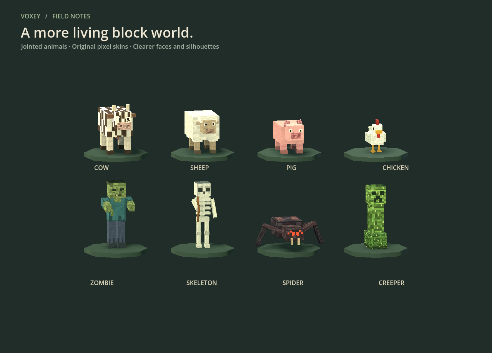
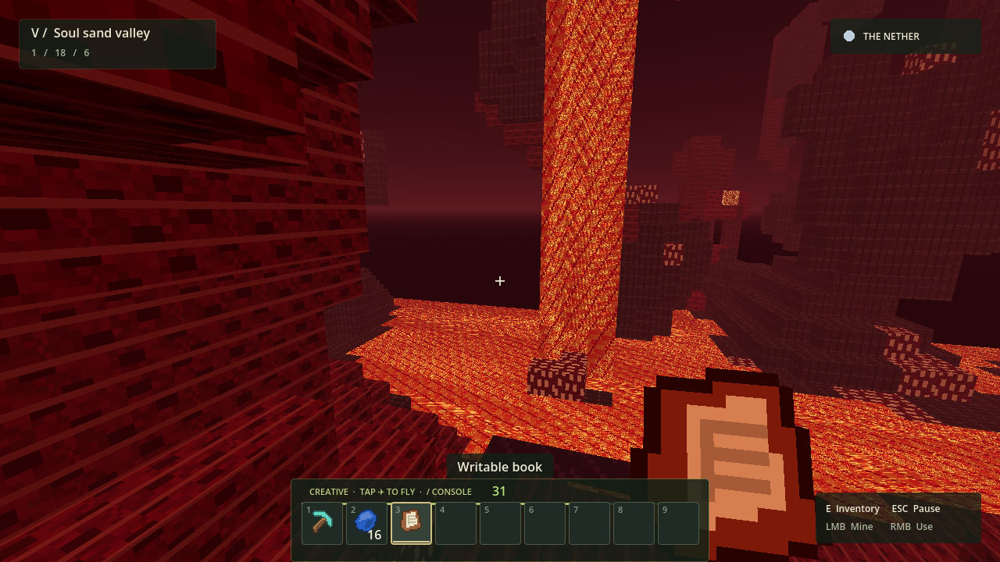

# Nether, enchanting, and creature update



Cows, sheep, pigs, and chickens now have jointed legs and heads, original pixel skins, distinct faces, and species details. Sheep keep their removable wool coat. Hostile models have additional anatomy, and skeletons hold their bows forward and wait until their bodies face the target before firing.

## Into the Nether

1. Find lava in deep caves, then place water beside it to make obsidian. Reactions work on all six faces and in either placement order. Collect source water or lava with a bucket. Mine obsidian with a diamond pickaxe.
2. Build a vertical **4×5 obsidian frame** in either horizontal orientation. Leave a **2×3 opening**; the four corner blocks are optional.
3. Use flint and steel on the frame's inner face, then stand in the portal for one second. Breaking a required frame block removes the portal.
4. Return through a portal. Horizontal coordinates scale by eight; nearby portals are reused, otherwise a safe platform and portal are created.



The Nether spans Y 0–127 and has netherrack caverns, bedrock above and below, lava seas and falls, quartz ore, hanging glowstone, and ruined nether-brick bridges. Its biomes are Nether wastes, Soul sand valley, Basalt deltas, Crimson forest, and Warped forest. The forests have giant fungi and shroomlights; soul sand slows walking. Piglins and jumping magma cubes populate this dimension.

Water cannot be placed in the Nether. Beds cannot set your spawn there; dying returns you to your Overworld spawn. Inventory travels with you. Terrain edits, chests, furnaces, crops, dropped items, and grounded arrows are stored separately for each dimension in the same world save. Menus and inactive dimensions pause pickup expiry timers.

This is an original adaptation to Voxey's separately saved dimensions, inspired by [Mineclonia's Nether and five-biome feature set](https://github.com/mark-wiemer/mineclonia/blob/main/README.md). It is not complete Mineclonia parity: there is no fluid spreading, fortress loot system, ghast/blaze roster, bartering, or portal-size variation yet. No external game assets or source code are bundled.

## Enchanting

Craft a table at a crafting table:

```text
          Book
Diamond   Obsidian   Diamond
Obsidian  Obsidian   Obsidian
```

Mine lapis lazuli ore below Y 22 for 4–9 lapis. Earn XP from mining ores, killing creatures, and achievements. The hotbar now shows a level number and progress toward the next level.

Right-click the placed enchanting table and choose equipment from your inventory:

| Tier | Required level | Required bookshelves | Cost |
| --- | --- | --- | --- |
| I | 1 | 0 | 1 lapis + 1 level |
| II | 10 | 5 | 2 lapis + 2 levels |
| III | 30 | 15 | 3 lapis + 3 levels |

Bookshelves must sit two blocks away horizontally, at table height or one block above, with an empty block between shelf and table. Up to 15 shelves contribute. Creative bypasses XP and lapis costs.

Tools receive Efficiency (faster appropriate-tool mining), swords Sharpness (additional melee damage), bows Power (additional arrow damage), and armor Protection (additional defense, capped at 80% total damage reduction). All receive Unbreaking, reducing durability use. Each item can be enchanted once; properties appear in inventory tooltips and a purple mark identifies enchanted gear.

## Books and leather

- Three sugar cane across a crafting table produce three paper.
- Three paper plus one leather, in any arrangement, make a book. Cows always drop 1–2 leather.
- Three books between two rows of planks make a bookshelf.
- A book, feather, and charcoal, in any arrangement, make a writable book. Charcoal serves as ink in Voxey.
- Hold a writable book and right-click to edit its title and up to 12,000 characters. Drafts update automatically; normal world saves persist them. Signing locks the text and produces a written book.

Each book owns its own text. Moving it through the cursor, chest, hotbar, ground, or a save retains that text. Written books can be read with right-click.

## Pickups and arrows

A dropped stack stays at its physical location unless your inventory can accept the entire stack, including compatible partially filled slots. Items with distinct properties do not merge. A full bag therefore cannot pull items toward the player.

Arrows collide using short physics steps to prevent passing through thin walls. Arrows stuck in the world can be picked up from nearby when there is inventory space. They last ten active minutes after impact. Saved arrows retain their age and orientation; saving and loading does not restart the timer. Ordinary drops retain their existing five-minute lifetime; arrow item drops last ten minutes.

## Validation and quick checks

Run `./tests/run_tests.sh` for the full suite. `tests/nether_checks.gd` exercises these features through the real game systems. `./tests/screenshots.sh` additionally renders the updated creature gallery, enchanting screen, book editor, and Nether.

For quick Creative inspection, use `/dimension nether`, `/give enchanting_table`, `/give lapis_lazuli 16`, `/give writable_book`, and `/xp 1200`.
