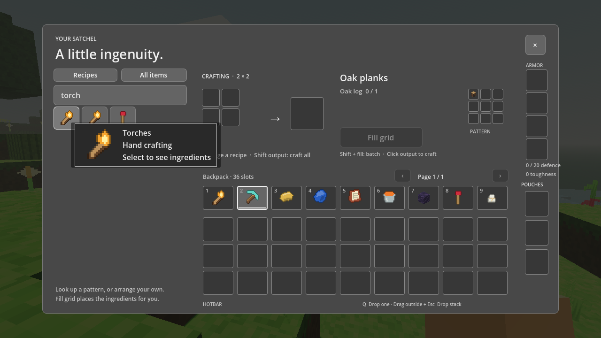

# Performance and interface update

The renderer uses the GPU for drawing, lighting and shaders. The Linux playtest reports **NVIDIA GeForce RTX 5090**, `gl_compatibility`, OpenGL 3.3. F3 now shows the active GPU and renderer. CPU terrain generation and meshing run in Godot's worker pool; scene objects and GPU mesh uploads stay on the main thread.

## Measured CPU changes

Median milliseconds across columns `(0,0)`, `(1,0)`, `(0,1)`, `(1,1)`, seed 8675309, Godot 4.7.2. These are headless CPU measurements, not GPU timings or a guarantee for every world.

| Operation | Overworld before | Overworld after | Nether before | Nether after |
| --- | ---: | ---: | ---: | ---: |
| Generate and mesh a column | 589.22 | 287.86 | 389.85 | 226.26 |
| Apply column on main thread | 152.05 | 1.08 | 111.06 | 0.69 |
| Copy remesh neighborhood | 10.84 | 0.53 | 10.35 | 0.52 |

The expensive full-column gameplay scan now runs on the worker. Results include indexes of circuits, structure chests, fire and fluids that need a reaction. The main thread reconciles newer edits and activates only relevant nodes. The mesher classifies tile properties once per tile type and uses array strides for face checks. Remeshing resolves 27 neighboring blocks once and copies rows directly. Streaming requests are sorted when the player crosses a column boundary or changes view distance, instead of searching the full view area every frame. Nether columns reuse their horizontal biome and height measurements. Existing edits already present in worker output no longer trigger redundant remeshing. Achievement inventory scans run once per second.

`tests/world_benchmark.gd` reproduces the CPU measurements. `tests/streaming_benchmark.gd` measures rendered frame times while moving through a world at view distance 4. The UI/rendering tour at distance 2 held the 60 FPS cap with 25 columns, 300 map blocks and 91 draw calls in its lava/torch scene.

The rendered movement benchmark covered 72.6 blocks in 12 seconds at view distance 4 while new columns were still generating. It recorded 721 frames: median 16.664 ms, 95th percentile 16.976 ms, maximum 19.188 ms, and 60 FPS at the configured cap. This measures this machine and route, not every scene. [Raw measurements](performance-measurements.json) retain the samples and renderer details.

## Behavior

- Menus, panels, slots and touch controls use neutral gray. Pause actions fit in rows and the panel scales to the window.
- The recipe guide uses five columns of item icons, with search, craftable outlines and larger texture/name previews on hover. Clicking an icon still shows its recipe and supports Fill grid.
- Deep sheltered caves keep fixed ambient light and fog through dusk, night and weather changes. The follow-up [environment fix](environment-update.md) preserves daylight in excavated pits and near outdoor openings.
- Lava's atlas coordinates are rounded before emissive classification, avoiding unstable floating-point equality tests. Its texture uses broad seamless pools. Torch inventory sprites have a transparent background, and torch models have correctly oriented sides and end caps.
- Torches attach to the floor or any of four walls. Their orientation persists in saves; removing the support drops the torch and removes its light.
- A broken tool is replaced in its original hotbar position by a carried tool with the same ID and metadata, including name and enchantments. The spare retains its own wear. Equipped pouch pages participate in the search.
- Furnaces reject input insertion while output is occupied, including clicks, swaps, Shift transfers, hoppers and droppers. Fuel insertion and item extraction remain available.
- `/gamerule keepInventory true` keeps inventory pages, pouches, armor and XP on death. It defaults to `false`, persists per world across dimensions, and can be queried with `/gamerule keepInventory`. Disabling it restores recovery chests and bone drops.
- Select a world and choose **Delete…** to open a confirmation naming that world. **Cancel** or Escape returns to the list. **Delete world** removes the world's data and backups. Deletion never follows mod-created symlinks into external files, and deleted legacy imports are not recreated on startup.

## Verification

The existing four suites passed 931 checks after the performance changes. `tests/polish_runner.gd` adds 64 checks covering snapshot equivalence, lighting, tool and pouch transactions, furnace insertion paths, torches, gamerule persistence/deaths, search and confirmed world deletion. `tests/polish_tour.gd` checks the rendered menus, tooltip and lava/torch scene. Tests use isolated save directories and do not delete user worlds.

The final environment update, including stair/masonry content and active fluid support, measured median column generation at 323.69 ms in the Overworld and 234.04 ms in the Nether. Main-thread application remained 1.09 ms and 0.73 ms respectively; neighborhood snapshots were about 0.51 ms. These four-column CPU samples are retained under `environment_cpu` in the raw measurements.

The completed fluid update’s rendered route covered 72.57 blocks in 12 seconds at view distance 4: 721 frames, median 16.667 ms, 95th percentile 16.836 ms, maximum 17.298 ms and 60 FPS at the configured cap. There were 319 draw calls and no unintended kelp drops. This route measures normal streaming with fluid simulation enabled; the separate environment tour verifies active waterfalls. The complete regression run passed 1,175 checks.

## Habitat streaming, 2026-09-16

The habitat update adds pasture simulation, sheep lifecycle changes, barriers, daylight detectors, targets and expanded cauldron behavior. A longer 40-second route crosses multiple unload boundaries and the first 30-second grass-spread interval. It exposed a repeated scan of all loaded grass/light entries for each departing column: median frames remained near 16.67 ms, but the worst frame reached 245.411 ms. Profiling localized the stalls to world processing at column boundaries.

Pasture now records membership by column for removal, and scans simulation candidates incrementally within its frame budget. The same 40-second rendered route then covered 240.58 blocks over 2,401 frames: median **16.666 ms**, 95th percentile **17.060 ms**, maximum **19.594 ms**, and **60 FPS** at the configured cap. No frame exceeded 33.33 ms or 100 ms. The final scene had 87 loaded columns, 1,044 map blocks and 4,292 pasture cells. These figures describe this machine and route; the longer route is not directly equivalent to the older 12-second benchmarks.

Reproduce it with `godot --path <isolated-project> --script res://tests/streaming_benchmark.gd -- 40`; omitting the duration keeps the original 12-second run. Both measurements are retained under `habitat_streaming_2026_09_16` in the [raw measurements](performance-measurements.json). The benchmark also reports counts of frames over 33.33 ms and 100 ms so rare stalls remain visible alongside percentiles.

## Travel and building streaming, 2026-09-16

The boat/map/trapdoor/snow update was checked on the same 40-second route, with a fixed camera and 60 FPS cap. The harness now explicitly draws the scene each frame because the desktop compositor can otherwise suppress drawing in an obscured window; a zero-draw run was discarded. The accepted final frame was visually checked and contained 448 draw calls and 239,632 primitives.

This run covered 240.52 blocks over 2,400 frames: median **16.660 ms**, 95th percentile **17.182 ms**, and maximum **45.181 ms**. One frame exceeded 33.33 ms; none exceeded 100 ms. Other headless validation was running concurrently. The changed explicit-draw harness means these are new baseline measurements, rather than evidence of a precise speedup or slowdown relative to earlier runs. This warm-biome route contained no snow candidates; separate snow regressions exercise bounded melting scans and generated Frostpine terrain.

Map capture also runs in background column jobs: its dedicated fixture measured 8.009 seconds to finish a mostly unseen survey, with a 0.574 ms maximum main-thread update. See [map scheduling](maps-source.md) and [raw measurements](performance-measurements.json).

## Classic trees and home features, 2026-09-16

The same rendered 40-second route, at the same 60 FPS cap and fixed camera, covered 240.57 blocks over 2,399 frames with the new tree/leaf simulation. Median frame time was **16.678 ms**, 95th percentile **17.499 ms**, maximum **33.342 ms**; one frame exceeded 33.33 ms and none exceeded 100 ms. The final image was visually checked and contained 322 draw calls and 186,922 primitives. Other headless validation ran concurrently.

The final loaded world contained 64 columns, 768 map blocks, 854 tracked leaves, zero orphan leaves and 25 queued leaf checks. Natural tree geometry and loaded column counts differ from the previous procedural-tree route, so these figures do not isolate a speedup or slowdown. Focused tests separately exercise unsupported leaf decay and bounded queue processing; this route measures ordinary streaming. The data is retained as `home_streaming_2026_09_16` in the raw measurements.

## Music and mechanisms, 2026-09-16

The 40-second rendered route with dungeon generation and the new mechanisms covered 240.57 blocks over 2,390 frames. Median frame time was **16.669 ms**, 95th percentile **17.700 ms**, maximum **34.121 ms**, at the 60 FPS cap. Six frames exceeded 33.33 ms; none exceeded 100 ms. The final scene had 53 columns, 636 map blocks, 364 draw calls and 146,770 primitives. Concurrent headless validation and different loaded geometry limit comparisons with earlier runs. The report is retained as `mechanisms_rendered` in the raw measurements.

Pressure plates share one spatial entity index per circuit tick. Dungeon generation runs on workers; active spawners limit collision/light candidates to eight per frame. The sixteen original note tones are generated offline and loaded from assets; a cold-load probe measured 2.7 ms for all sixteen, avoiding synthesis during live playback. The exported content smoke test loaded all eight music recordings, sixteen tones, tree data and music attribution from a standalone resource pack.

`tests/mechanism_tour.gd` checks rendered buttons, pressure plates, note blocks, jukeboxes, compressed ice, bone axes, spawner cages, inventory icons and the field guide's music credits. It uses an isolated save directory.

## Crops, honey and crystals, 2026-09-16

The same 40-second rendered route covered 240.56 blocks over 2,397 frames at the 60 FPS cap. Median frame time was **16.686 ms**, 95th percentile **17.404 ms**, and maximum **50.183 ms**. One frame exceeded 33.33 ms; none exceeded 100 ms. The final frame was visually inspected: 45 columns, 540 map blocks, 344 draw calls and 132,710 primitives. Full headless regression ran concurrently, and loaded geometry differs from earlier batches. These measurements do not isolate a speedup or slowdown; the raw report is `nature_rendered`.

Geode planning stays on generation workers. In a sampled geode area, planning the 25 neighboring candidates cost about 73 ms cold, including approximately 14 ms of structure checks and 50 ms of geometry planning. The generator-local cache makes repeated direct calls inexpensive, but normal streaming creates a fresh generator for each worker job and therefore still pays cold planning costs. No main-thread or cross-thread cache speedup is claimed. Hive simulation shares a 128-sample budget among production jobs; seven due hives took 1.056 ms in the focused check.

`tests/nature_tour.gd` visually checks all stem stages, fruit and carved faces, hive honey levels, transparent honey/tinted glass, all crystal attachment directions, inventory icons, actual held/dropped transparent models, the pumpkin helmet mask, the spyglass aperture and a cutaway of an actual seeded geode. It uses temporary saves. The initial render exposed invalid crystal icon polygons and the pumpkin mask's missing eye cutouts; both were fixed and the clean tour repeated. A separate review found empty held/dropped meshes for the two new transparent blocks; their mesh surface and material selection were corrected and visually verified.

## Streaming lag fixes (issue #1), 2026-09-24

Issue #1 reported slow chunk generation and "extreme lag at random" that went away once the player stayed in one place. It was measured on a four-core laptop CPU with **Mesa Intel HD Graphics 520**, which is closer to typical player hardware than earlier measurements. There, generation had become about eight times slower than the figures above, and several main-thread tasks grew with the size of the world.

- **Per-node rule chains.** `Nodes.solid` cost about 22 µs, `transparent` 26 µs and `tile` 16 µs, because each is a long chain of family checks. The mesher and the column index asked them for all 49,152 nodes of a column, so generating one Overworld column took about 2.4 s.
- **One worker.** Terrain jobs were low-priority tasks. Godot's worker pool gives those only 30% of its threads, which is a single thread on a four-core CPU. With a fresh generator per job, structure and ore plans were rebuilt for every column.
- **Whole-world walks.** Each column that streamed in walked every edit in the world three times and re-registered every nearby edit through about forty checks. Applying a column next to 4,000 edits took over 600 ms. `open_sky` also walked every edit.
- **Churn in fresh terrain.** Every natural leaf was queued for a decay search when its column loaded. About 5% of generated flowers and tall grass stood on ground a structure had replaced, so they broke and dropped as items as soon as their column arrived.
- **Autosave stalls.** The 45-second autosave serialized the world on the main thread: 251 ms with 40,000 edits.
- **First-use costs.** Shader variants compile when a material is first drawn: 200–1,200 ms on this driver, the first time a creature, dropped item or particle came into view. Each creature kind also builds its textures and meshes on first spawn: 12–32 ms.

### Changes

- **`NodeInfo` lookup tables.** `NodeInfo` classifies each node id once into a bit set: solidity, transparency, cube and occlusion flags, fluid kind, gameplay index flags, custom mesh kind, unit-cube collision and atlas tiles. Only the main thread writes the shared tables. A worker job gets its own snapshot and returns the ids it had to classify. `Nodes.solid`, `transparent`, `plant`, `tile` and `title`, light filters and light emission are memoized the same way.
- **Mesher.** The mesher reads one flag word per node. It finds visible faces in one pass that skips air and enclosed solid layers, and greedy-merges only the faces it found. Its output is byte-identical to the previous mesher.
- **Generator.** Padded blocks are assembled from layer slices. Deep and Nether terrain are evaluated one column at a time. Pasture membership is split on the worker, so the main thread merges it whole.
- **Worker scheduling.** Generators are pooled, one job each at a time, and ore clusters are cached per mapchunk. Terrain jobs run at high priority, up to CPU count minus two at once. Desert temples and ocean ruins shuffled their suspicious nodes with the global random generator; they now use their own seeded one, so generation is deterministic and independent of column order.
- **Vertical view range.** Map blocks more than `radius` levels above or below the player are generated but not meshed until the player's level brings them into range. The fog makes them invisible anyway.
- **Edit index and load hooks.** Edits are indexed by column. Column loads, `open_sky`, sponges, copper and rain read only the columns they need. Load-time registration uses a per-id hook table. Generated leaves are only searched for support when an edit lies within reach, and unsupported flowers and grass are never generated.
- **Autosave.** The main thread captures the world state. A worker builds the edit list, serializes it and writes the file. Manual saves, world switches and deletion wait for it first.
- **Loading-screen warm-up.** During the loading screen, the game draws one object of each common material kind, keeping those materials for the session so their shaders stay compiled, and builds every creature kind's art.
- **Per-tick and per-frame savings.** Creatures sample line of sight five times a second rather than every physics tick, and only hostile mobs look. Remesh snapshots copy whole rows. The HUD reuses its style boxes. Physics replays at most four missed ticks after a slow frame, so one hitch no longer cascades.
- **Fog.** Fog uses depth mode and is opaque at the view distance (`radius × 16` blocks). Columns still loading at the edge are hidden behind haze, as the issue suggested.

### Measurements

The CPU figures are headless, seed 8675309, on the same four-core machine for both builds. Before is the parent commit, run the same way.

| Measurement | Before | After |
| --- | ---: | ---: |
| Generate and mesh an Overworld column (median of 4) | 2,418 ms | 266 ms |
| Generate and mesh a Nether column (median of 4) | 1,504 ms | 106 ms |
| Apply a column on the main thread, no edits | 16.5 ms | 7.5 ms |
| Apply a column containing 1,000 edits | 179 ms | 54 ms |
| Apply a column containing 4,000 edits | 627 ms | 171 ms |
| Autosave, main-thread time, 40,000 edits | 251 ms | 5 ms |

The rendered benchmark is `tests/survival_streaming_benchmark.gd`. It is a survival world at view distance 4 with an uncapped frame rate, crossing 120 blocks at sprint speed in 20 seconds. On the parent commit, loading into the world took **85.3 s**. While moving, generation never caught up: the final view had **0%** of its columns loaded, with one column drawn. Its frame times therefore measure an almost empty scene. With the fixes:

| Rendered run | Load | View loaded at end | Median | 95th percentile | Frames > 100 ms | Average FPS |
| --- | ---: | ---: | ---: | ---: | ---: | ---: |
| Run 1 | 4.1 s | 81% | 17.2 ms | 66.2 ms | 2 | 40.9 |
| Run 2 | 3.6 s | 81% | 17.8 ms | 64.7 ms | 7 | 40.0 |

Both runs pass a pillager outpost. Its party of about twenty mobs fighting iron golems accounts for most frames over 33 ms near the end of the route. Before the shader warm-up and creature-sight changes, the same route had around fifty frames over 100 ms, and single frames of up to 400 ms.

`tests/lag_benchmark.gd` reproduces the CPU rows, and `tests/world_benchmark.gd` the per-column figures. Raw results are under `streaming_lag_2026_09_24` in the [raw measurements](performance-measurements.json). All nine suites passed: 7,411 checks.

### Second pass: mobs, the overlay and streaming

On the same machine, the next largest costs were mob simulation, the in-game overlay and repeated work when streamed columns arrived.

- **Bunched physics ticks.** After a slow frame the engine runs several physics ticks, and each mob stepped in every one, although only the last is ever seen. A mob now steps on the first tick of each rendered frame, and again only once 1/30 s has built up, carrying the time forward. At 60 FPS every tick steps as before. Direct calls, as scripted checks use, always step. Dropped items do the same.
- **Mob step costs.** The villager search that hunting mobs run is refreshed four times a second instead of scanning every creature each tick. Collision reads each map block's nodes directly. Still axes skip collision queries. The terrain height for the daylight burn check is cached per cell. Mobs beyond the fog's far edge skip posing, and the body turns only when its facing actually changes. Mobs with no potion effect skip the per-effect scan.
- **Overlay.** The in-game overlay is redrawn only when something it shows changes, and every frame while something on it animates.
- **Worker table reads.** Worker threads read the shared node tables directly. The main thread writes whole entries in place and the tables are shared by reference, so readers never see a torn entry. Custom geometry on workers, such as grass, flowers and village decorations, no longer falls back to the full rule chains.
- **Column loads with edits.** A column's worker records the edits it generated with. When the column is applied, those unchanged edits are not registered a second time, except for the few kinds the worker's index does not cover.
- **Vertical meshing.** Map blocks entering the vertical range are meshed immediately, even if a neighbouring column is still generating, and meshed again when it arrives. They may use idle generation slots.

| Measurement | After the first pass | After the second pass |
| --- | ---: | ---: |
| 32 hostile mobs around the player at night (`tests/mob_crowd_benchmark.gd hostile`) | 12.4 FPS, median 78.5 ms | 32.3 FPS, median 29.1 ms |
| 32 farm animals around the player (`… passive`) | 13.7 FPS, median 71.5 ms | 33.9 FPS, median 27.4 ms |
| Rendered survival route, average FPS | 40.0–40.9 | 44.5–45.9 |
| Rendered survival route, 95th percentile | 64.7–66.2 ms | 44.4–53.4 ms |
| Apply a column containing 1,000 edits | 54 ms | 20 ms |
| Apply a column containing 4,000 edits | 171 ms | 53 ms |

Each crowd run adds its 32 mobs to the world's own spawns, about 55 mobs in total. The parent commit could not complete the crowd benchmark: it had not finished loading after ten minutes. Raw results are under `streaming_lag_2026_09_24.second_pass` in the [raw measurements](performance-measurements.json). All nine suites passed: 7,411 checks.
