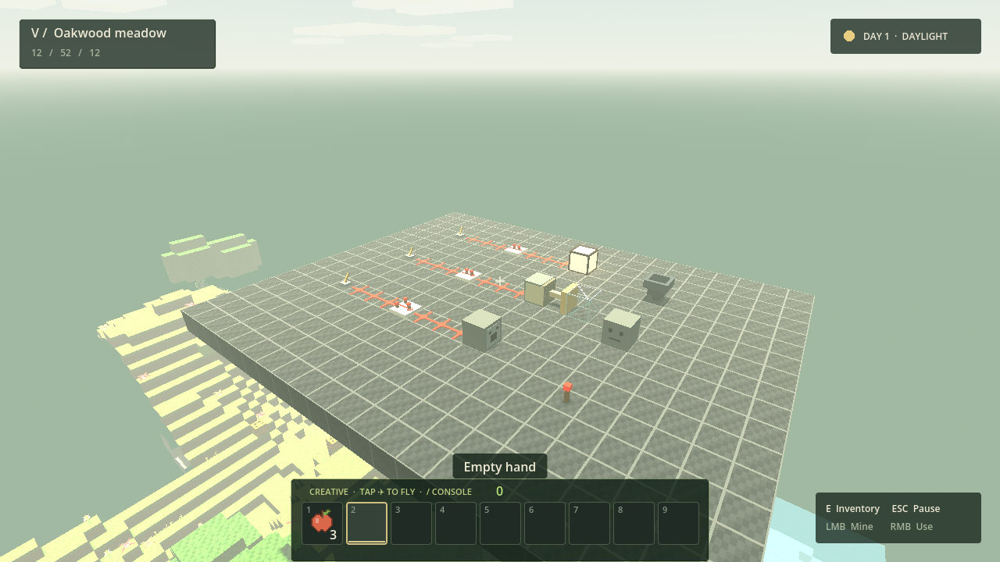
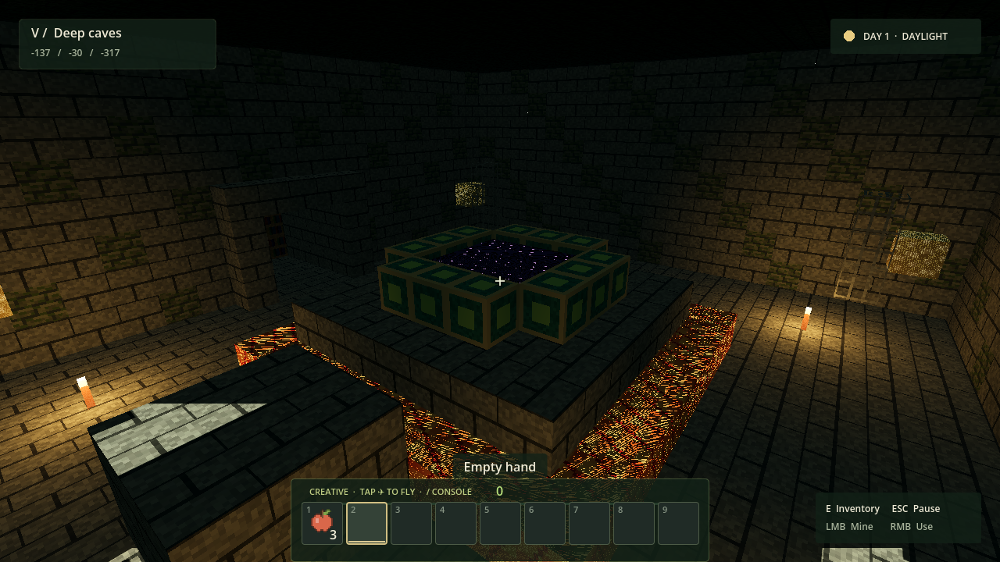
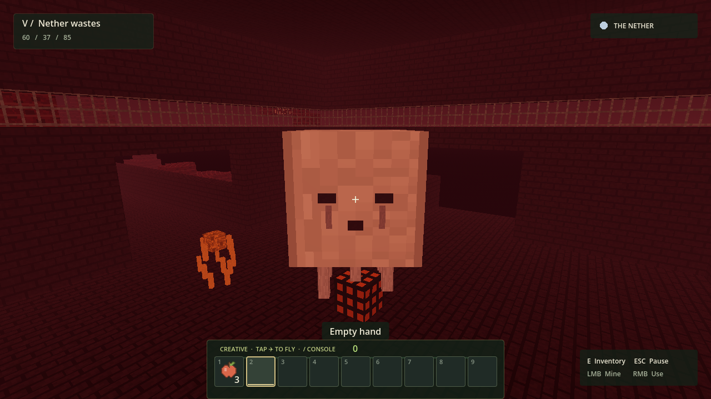
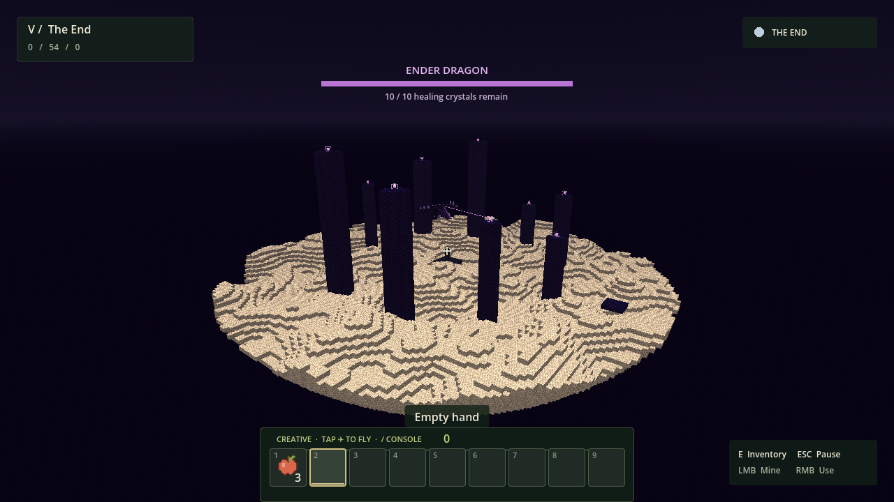

# Redstone, the Nether, and the End

Voxey now has a playable survival route from mining redstone and building machinery to finding a stronghold, defeating the Ender Dragon, and exploring outer End cities. These systems work in existing worlds; saved edits take priority over new generated structures.

## Redstone controls

Mine redstone ore below Y −16 with an iron or diamond pickaxe. Recipes are in the inventory's searchable guide. Components face the direction you look when placing them; pistons, observers, dispensers, and droppers also support vertical placement. Hold Ctrl to place against an interactive block.

| Component | Behavior |
| --- | --- |
| Chest | A trapped chest sends full strength to every block beside it while it is open, so a wire and a lamp make an alarm. |
| Dust | Carries strength 15 down to 1 over fifteen blocks; connects across chunk boundaries and one-block steps. |
| Lever | Right-click to toggle persistent power. |
| Button | Right-click for a one-second pulse. |
| Pressure plate | Players, creatures, and dropped items activate it. |
| Redstone torch | Inverts the power of its supporting block. A torch switched off **eight times within thirty seconds** burns out and stays dark until its count expires, which is the reference's fast-clock limiter. |
| Repeater | Restores strength to 15 in its forward direction. Right-click cycles 1–4 redstone ticks (0.1–0.4 seconds). Short pulses stretch to its delay; a powered repeater/comparator pointing into a side locks its output. |
| Comparator | Reads rear signal or container fullness. Right-click toggles compare/subtract; side inputs determine the result. |
| Observer | Watches the block opposite its red output dot; changes produce a two-tick pulse. |
| Piston | Pushes up to twelve blocks. Obsidian, bedrock, portals, containers, beds, and extended pistons resist movement. |
| Sticky piston | Pushes the same way and pulls one movable block back. Slimes supply slime balls. |
| Lamp / redstone block | A powered lamp lights its surroundings; a redstone block is a constant source. |
| Iron door | Both halves open while either half receives power. |
| Dispenser | Opens storage on right-click. A rising power edge fires one arrow, primes TNT in the next cell, or ejects another item. |
| Dropper | Ejects one item per rising power edge, or inserts into an adjacent container if there is room. |
| Hopper | Collects items from above and sends one item every 0.4 seconds toward its outlet. Power locks it. It respects full containers and preserves item metadata. Furnace input is above, fuel enters from a side, and a hopper underneath takes output. |

Circuit directions, outputs, repeater delays and pending pulses, comparator mode, piston extension, and machine contents save independently in each dimension. Simulation pauses with gameplay and when its chunks unload. This is Voxey's deterministic circuit model; Java/Bedrock update-order quirks and quasi-connectivity are not reproduced.

## Redstone torch burnout

A redstone torch is not a free oscillator. Every time it is switched off — its supporting block gains power — its burnout count rises by one, and each count is removed **thirty seconds** later. Once **eight** counts are pending the torch refuses to relight, so a torch wired into a tight loop stops oscillating instead of running forever.

The count lives in the block's saved state, so a burnt-out torch is still burnt out after leaving and returning. This is the reference's `burnout_tab`: `inc_burnout` on the on-to-off edge, `mcl_redstone.after(30, ...)` to decrement one count, and `check_burnout` gating the off-to-on edge at eight.

## Nether to stronghold

1. Build and light an obsidian Nether portal. Explore the five Nether biomes and nether-brick fortresses.
2. Fortress spawners produce blazes. Their rods craft into blaze powder. Ghasts fly through open caverns and fire explosive projectiles; hit a fireball with an attack or arrow to send it back. Ghasts drop tears, and magma cubes drop magma cream.
3. Endermen appear in all three dimensions. Staring or attacking provokes them; they teleport and drop pearls. Use a pearl to throw it. On impact it teleports you to a nearby clear, supported landing and costs five health in Survival.
4. Combine a pearl and blaze powder into an Eye of Ender. Throw it in the Overworld and follow its flight. Near a stronghold it descends toward the underground portal room. Four out of five Survival throws can be recovered; the fifth shatters.
5. Search the stronghold's stone-brick passages, library, and loot chests. Right-click each of the twelve empty portal frames with an Eye. The final Eye opens the End portal.

## The End

Arriving creates a clear obsidian platform. The central island has ten obsidian towers with End crystals, including two caged towers. Nearby crystals heal the dragon through visible beams. Arrows or attacks destroy crystals; their explosions can hurt nearby entities. The dragon circles, swoops, perches, and launches purple breath clouds. Its health and remaining crystals appear above the crosshair.

Defeat the dragon for XP, a dragon egg on the central fountain, and an open return portal. A gateway near the arrival platform leads to the outer islands; its partner brings you back. Outer islands contain chorus plants and purpur cities guarded by shulkers. Shulker homing shots cause temporary levitation and can be destroyed with an attack or arrow. City treasure includes elytra: equip them in the chest slot, hold Jump while falling, and aim to glide and dive. Gliding wears out the wings; they stop working at their durability limit.

Four crafted End crystals placed on the cardinal edges of the exit fountain summon another dragon and restore the towers. Dragon health, encounter phase, defeated state, destroyed/placed crystals, city guards already defeated, portals, treasure contents, and dimension edits persist through saving and travel. Ordinary roaming mobs retain the game's existing respawn behavior.

## Useful commands

- `/dimension overworld`, `/dimension nether`, `/dimension end`
- `/locate stronghold`, `/locate fortress`, `/locate end_city`
- `/give redstone_repeater 8`, `/give eye_of_ender 12`, `/give ender_pearl 16`
- `/spawn ghast`, `/spawn blaze`, `/spawn enderman`, `/spawn shulker`

The pause menu's field guide explains these controls inside the game. This is an original adaptation, with procedural models and textures. The Nether-to-stronghold route follows the progression described in [Minecraft's stronghold guide](https://www.minecraft.net/en-us/article/stronghold). It does not bundle Minecraft or Mineclonia code or assets. Features such as multiplayer, flowing fluids, brewing, the Wither, bastions, and the complete Mineclonia block/mob roster remain outside this expansion.

## Verification

`./tests/run_tests.sh` runs the existing survival suite plus `tests/expansion_checks.gd`. The expansion checks exercise circuits and machinery, item transactions, structure generation, actual projectile impacts, Nether/End travel, dragon healing and defeat, save/reload, respawning the dragon, gateways, city loot, levitation, and gliding. `./tests/screenshots.sh` includes a rendered redstone and End tour.

## Rendered checks

